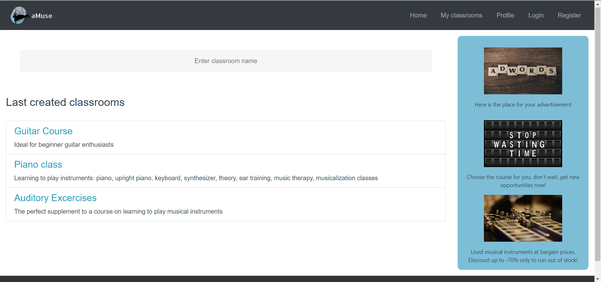
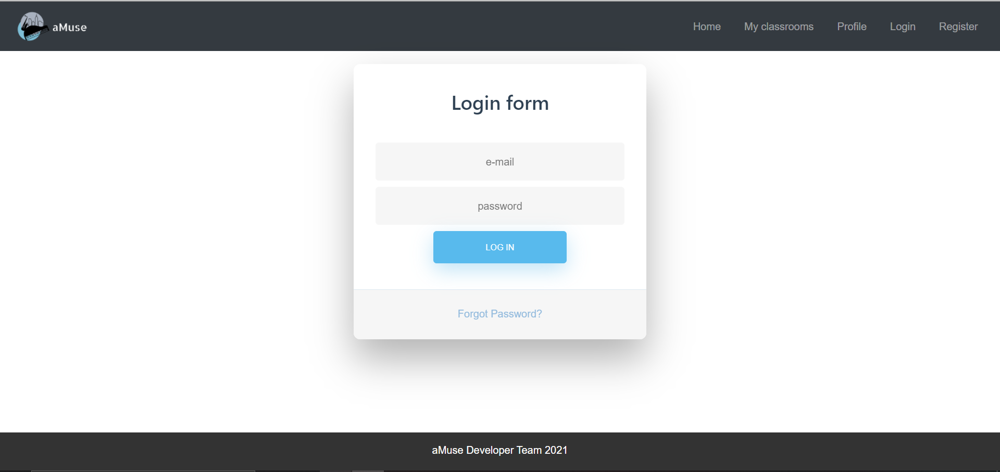
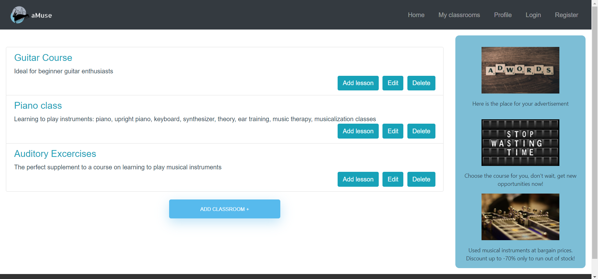
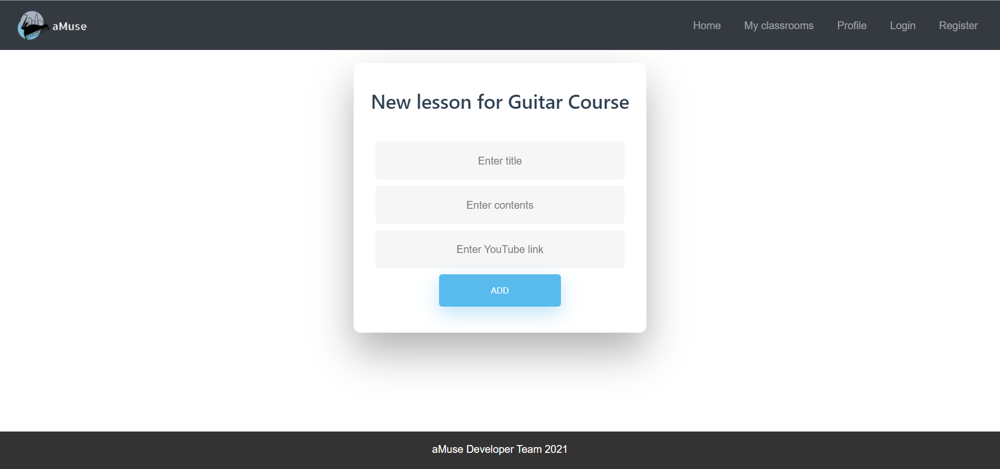
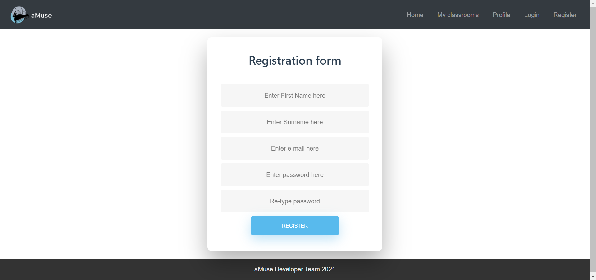

# amuse_front-end
Front-end to a web-based social network designed to post courses that can be used by the rest of the community. Project interface created for a credit project during college.
Back-end repository: https://github.com/Szczoder97/aMuseREST_API
<h2>1. Charakterystyka oprogramowania:</h2>

<h2>Nazwa skrócona:</h2> <b>aMuse</b>

<h2>Nazwa pełna:</h2> <b>Online Music Academy</b>

<h3>Opis:</h3> Aplikacja internetowa gromadząca społeczność zainteresowaną edukacją muzyczną.   
Każdy użytkownik może dzielić się swoją wiedzą oraz czerpać inspirację od bardziej doświadczonych osób.  
Serwis jest bezpłatny a wszystkie informacje udostępnione na nim mają za zadanie rozwijać pasje jego członków.  

<h3>Cele:</h3>
- tworzenie lekcji na zasadzie artykułów z danego zagadnienia z możliwością przesłania danych binarnych
- tworzenie klas
- z poziomu klas dostęp do lekcji

<h3> Prawa autorskie </h3> 
Autorzy: Paweł Szczodrowski, Patryk Pawłowicz  
Licencja: Open source

<h2>2. Interfejs graficzny:</h2>

 

 

 

 

 

<h2>3. Specyfikacja wymagań:</h2>

<h3>Wymagania funkcjonalne</h3>

| Identyfikator | Nazwa krótka | OPIS | Priorytet |
|---------------|--------------|------|-----------|
| AUTH | Autentykacja | <ul> <li>Możiwość rejestracji oraz logowania do serwisu internetowego za pośrednictwem maila i hasła.</li> <li> Identyfikacja użytkownika następuje na podstawie JWT. </li> </ul> | 1 |
| SEC | Bezpieczeństwo | <ul><li>Hasła przechowywane w bazie danych są zaszyfrowane, administrator systemu nie ma do nich dostępu</li><li>Java Web Token ma żywotność 24h - po tym czasie zapytania HTTP nie będą obsługiwane</li><li>Poszczególne endpointy są zabezpieczone przed nieautoryzowanym dostępem, tylko właściciel zasobu może go edytować lub usunąć</li></ul> | 1 |
| CC | Zarządzanie klasami | <ul><li>Uwierzytelniony użytkownik systemu ma możliwość przeglądania listy klas z głównego widoku strony.</li><li>Może również dodawać własne klasy uzupełniając je o pola: tytuł, opis. </li><li>Właściciel klasy ma możliwośc edycji, oraz usunięcia niechcianej klasy. </li><li>Do każdej klasy właściciel może dodać nieograniczoną liczbę lekcji.</li><li>Wchodząc na daną klasę wyświetlają się jej szczegółowe informacje oraz lista lekcji</li></ul> | 1 |
| LC | Zarządzanie lekcjami | <ul><li>Uwierzytelniony użytkownik systemu ma możliwość przeglądania listy lekcji z głównego widoku klasy.</li><li>Właściciel klasy może tworzyć przypisane do niej lekcje</li><li>Właściciel klasy ma możliwośc edycji, oraz usunięcia niechcianej lekcji. </li><li>Tworząc zasób lekcji należy podać tytuł, zawartość lekcji oraz link do filmiku na serwisie YouTube</li><li>Wchodząc na daną lekcję wyświetlają się jej zawartość oraz okienko z filmiem</li></ul> | 2 |
| CONTACT | Sekcja kontakt | Umożliwienie komunikacji z autorem poszczególnych klas | 3 |
| AD | Sekcja reklamowa | <ul><li>Umożliwienie zamieszczenia na stronie reklam z zakresu tematyki muzycznej, potencjalnie interesujących dla odbiorców aplikacji</li><li>Ponieważ portal jest darmowy, reklamy mogą stanowić dla niego formę przychodu - zarobku na utrzymanie serwisu.</li></ul> | 3 |

<h3>Wymagania niefunkcjonalne</h3>

a) <b>Wymagania produktowe</b> 
<ol>
<li>System będzie posiadał przyjazny interfejs graficzny, co umożliwi bezproblemowe użytkowanie dla wszystkich osób, niezależnie od posiadania niewielkiej lub całkowitego braku  umiejętności w obsłudze podobnych systemów.</li>
<li>Przewiduje się dużą niezawodność: system powinien być w stanie działać bezawaryjnie 24 godziny na dobę, z możliwą awarią lub nieaktywnością w nie więcej niż 1 dzień na miesiąc, gdzie usunięcie awarii lub ponowna aktywacja systemu nie powinna zająć doświadczonemu informatykowi dłużej niż 2 godziny.</li>
<li> Wszystkie dane przechowywane przez system będą zabezpieczone poprzez zabezpieczenia systemu operacyjnego, na którym zostanie zainstalowany.</li>
<li> Środowisko testowe powinno być stworzone w taki sposób aby funkcjonalność aplikacji była możliwa do przetestowania.</li>
</ol>

b) <b>Wymagania organizacyjne</b> 

<ol>
<li> Głównym środowiskiem działania aplikacji webowej będą komputery stacjonarne oraz laptopy - wersja domyślna będzie stworzona pod kątem użytkowania strony aplikacji w wersji komputerowej. Będzie ona jednak również obsługiwana na urządzeniach mobilnych, takich jak tablety, smartphone'y oraz podobnych modyfikacjach tych urządzeń, jeśli tylko będą one posiadały aktywny dostęp do Internetu oraz aktualną przeglądarkę dowolnej marki. </li> 
<li> Ze względu na swoją dużą kompatybilność, jedynymi wymaganiami implementacyjnymi będzie w pełni sprawny serwer z bazą danych, stały dostęp do Internetu, przynajmniej jeden w pełni sprawny terminal dostępu ( komputer osobisty ) oraz przynajmniej jedna osoba z doświadczeniem informatycznym z zakresu obsługi podobnych systemów.</li>
</ol>

c) <b>Wymagania zewnętrzne</b> 
<ol>
<li> W celu ścisłej ochrony prywatności i zapewnienia ochrony informacji konta wszystkich klientów będą zabezpieczone hasłami znanymi tylko dla nich. Zarówno personel firmy, jak i osoby zewnętrzne nie będą miały dostępu do tych kont.</li>
</ol>

<h2> 4. Architektura systemu/oprogramowania </h2>

A. <b>Architektura rozwoju</b> 

| Lp. | Nazwa produktu | Przeznaczenie produktu | Wersja |
|-----|----------------|------------------------|--------|
| 1 | ASP .NET Core | Warstwa API systemu | 5 |
| 2 | Blblioteka klas C# | Warstwa domenowa i warstwa infrastruktury | Core |
| 3 | AutoMapper | Mapowanie obiektów domentowych na obiekty DTO | 8.1.1 |
| 4 | NUnit | Testy jednostkowe, end to end | 13 |
| 5 | VUE | Warstwa Front end | 3 |
| 6 | MsSQL | Baza danych | 11 |
| 7 | Entity Framework Core SQLServer | Warstwa komunikacji interfejsu Web API z bazą danych MsSQL, mapowanie modeli domenowych na tabele w bazie danych | 5.0.6 |
| 8 | IdentityModel.Token.JWT | Generowanie JWT | 6.11.0 |
| 9 | Microsoft.AspNetCore.Authentication.JwtBearer | Autoryzacja na podstawie tokenu JWT | 5.0.6 |

B. <b>Architektura uruchomieniowa: </b>

| Lp. | Nazwa produktu | Przeznaczenie produktu | Wersja |
|-----|----------------|------------------------|--------|
| 1 | .NET Core | Środowisko uruchomieniowe | 5 |
| 2 | Baza danych MsSQL | Przechowywanie danych użytkowników | EXPRESS |
| 3 | Swashbuckle.AspNetCore | Uruchomienie klienta Swagger w celu testowania manualnego | 5.6.3 |
| 4 | Swashbuckle.AspNetCore.Filters | Rozszerzenie funkcjonalności klienta Swagger o autentykację | 7.0.2 |

